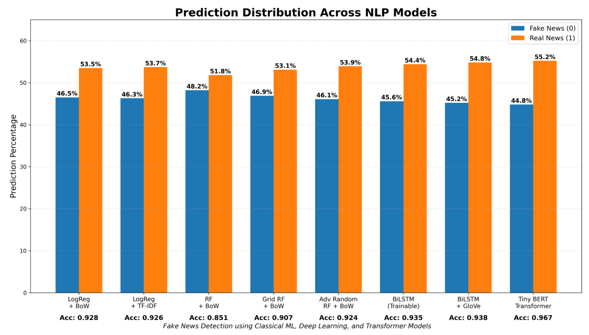

# Fake-news-detection-classical-to-transformer-nlp

## Group Project

This group project investigates fake news detection using a wide range of Natural Language Processing (NLP), Machine Learning, and Deep Learning techniques. The project compares traditional text classification methods with modern embedding-based and transformer-based approaches to evaluate their effectiveness in identifying fake and real news articles.

---

# Team Members

| Member |  GitHub |
|---|---|
| Alan An Jung Wei | [alananjungwei](https://github.com/alananjungwei) |
| Laxmi Gupte |  [laxmigs24](https://github.com/laxmigs24) |
| Nicole Segura |  [nicolesegura121](https://github.com/nicolesegura121) |

---

# Objectives

- Build a fake news classifier
- Compare classical NLP and transformer approahces
- Evaluate multiple machine learning models 
- Perform inference on unseen news data (the testing dataset)
- Analyze model performance and prediction behaviour

---

# Project Structure


```text
Fake-news-detection-classical-to-transformer-nlp/
│
├── data/
│   ├── training.csv
│   └── testing.csv
│
├── testing_updated/
│   └── testing.csv
│
├── images/
│   ├── prediction_testing.png
│   └── prediction_2.png
│
├── notebooks/
│   ├── notebook_datacleaning.ipynb
│   ├── notebook_Alan.ipynb
│   ├── notebook_Nicole.ipynb
│   └── notebook_Laxmi.ipynb
│
├── Presentation.pdf
└── README.md
```

* The updated testing.csv file containing the best model's predictions is in the testing_updated folder

---
# Dataset

The training dataset consists of news headlines/articles labeled as:
- 0 → fake news
- 1 → real news

The testing dataset contained placeholder labels (2), which were replaced using model predictions.

---

# Workflow Overview 


## Data Cleaning Section 

* Loading and organizing the training and testing datasets
* Renaming columns for consistency (labal, text)
* Checking for missing values, dupicated rows, and data imbalance
* Cleaning text by lowercasing, removing punctuation, removing stopwords, tokenization, lemmatization, and removing unncessary symbols and whitespace
* Performing exploratory data analysis (EDA) to understand class distribution, text patterns, and frequent words 


## Classical NLP Section 

Traditional Natural Language Processing techniques were implemented using sparse vector representations of text.

Models explored:
- Bag-of-Words (BoW) + Multinomial Naive Bayes
- TF-IDF + Multinomial Naive Bayes
- TF-IDF + Support Vector Classifier (SVC)
- Logistic Regression + BoW
- Logistic Regression + TF-IDF
- Random Forest + BoW

Feature engineering experiments included:
- n-gram tuning
- max_df and min_df adjustments
- vocabulary size optimization
- normalization techniques

## Embedding Section 

Dense vector embeddings were used to capture semantic meaning and contextual relationships between words.

Embedding approaches explored:
- SentenceTransformer (`all-MiniLM-L6-v2`) + Logistic Regression
- SentenceTransformer (`all-MiniLM-L6-v2`) + LinearSVC
- Qwen3 Embeddings + SVC
- BGE-small-v1.5 Embeddings + SVC
- BiLSTM with Trainable Embeddings
- BiLSTM with pretrained GloVe embeddings

These methods aimed to improve semantic understanding compared to traditional sparse vector approaches.


## Transformer Section 

Transformer architectures from Hugging Face were fine-tuned for fake news classification.

Models explored:
- DistilBERT (`distilbert-base-uncased`)
- BERT Tiny Transformer
- RoBERTa Fake News Detector

The transformer models leveraged contextual embeddings and transfer learning to achieve stronger classification performance on unseen data.


## Hyperparameter Tuning 

Hyperparameter optimization was performed using:
- GridSearchCV
- RandomizedSearchCV

Parameters explored included:
- n-gram ranges
- max_df and min_df
- vocabulary size
- SVC regularization (`C`)
- kernel selection
- Random Forest depth and estimator count

# Results Table 

| Model | Main Change | Accuracy | Precision | Recall | F1-Score |
|---|---|---|---|---|---|
| BOW + MultinomialNB | default| 0.93 | 0.93 | 0.94 | 0.93 | 
| BOW + MultinomialNB | n_gram (1, 2), max_df = 0.95, min_df = 2, max_features = 10000 | 0.93 | 0.93 | 0.93 | 0.93 | 
| BOW + MultinomialNB| n_gram (1, 2), max_df = 0.99, min_df = 1, max_features = 50000 | 0.94 | 0.94 | 0.94 | 0.94 | 
| BOW + MultinomialNB | n_gram (1, 2), max_df = 0.95, min_df = 2, max_features = 50000| 0.94 | 0.94 | 0.94 | 0.94 | 
| TF-IDF + MultinomialNB | n_gram (1, 2), max_df = 0.95, min_df = 2, max_features = 20000 | 0.93 | 0.93 | 0.94 | 0.93 | 
| TF-IDF + MultinomialNB | n_gram (1, 3), max_df = 0.95, min_df = 2, max_features = 50000 | 0.94 | 0.94 | 0.94 | 0.94 | 
| Sentence Transformer + Logistic Regression | default | 0.92 | 0.91 | 0.93 | 0.92 | 
| Sentence Transformer + Logistic Regression | C = 10 | 0.92 | 0.91 | 0.93 | 0.92 | 
| Sentence Transformer + LinearSVC| default | 0.93 | 0.91 | 0.94 | 0.93 | 
| Sentence Transformer + LinearSVC| C = 10 | 0.92 | 0.91 | 0.94 | 0.93 | 
| Sentence Transformer + LinearSVC| C = 100 | 0.92 | 0.91 | 0.94 | 0.93 | 
| DistilBERT | default | 0.9618 | 0.9474 | 0.9784 | 0.9626 |
|SVC+TF-IDF | Baseline| 0.82|0.93 |0.91 |0.92 |
|SVC+TF-IDF | n_grams(1,2), max_df = 80%| 0.935|0.95 |0.92 |0.93 |
|SVC+TF-IDF | n_grams(1,2), min_df = 3| 0.936|0.95 |0.92 |0.93 |
|SVC+TF-IDF | n_grams(1,2), min_df = 3, SVC(C=10,gamma=1, Kernel="linear")| 0.923|0.93 |0.91 |0.92 |
|SVC+Qwen3(embedding) | n_grams(1,2), min_df = 3, SVC(C=10,gamma=1, Kernel="linear")| 0.916|0.92 |0.91 |0.92 |
|SVC+BGEsmallv1.5(embedding) | n_grams(1,2), min_df = 3, SVC(C=10,gamma=1, Kernel="linear")| 0.917|0.92 |0.91 |0.92 |
|RoBerta-Fake-NewsDetector | Fine Tuned with Trainer| 0.966|0.97 |0.96 |0.97 |
| Logistic Regression + BoW    | CountVectorizer with BoW features               | 0.92| 0.92 | 0.92 | 0.92 |
| Logistic Regression + TF-IDF | TF-IDF vectorization with n-grams               | 0.92 | 0.92 | 0.92 | 0.92 |
| Random Forest + BoW          | Baseline Random Forest classifier               | 0.85 | 0.85 | 0.84 | 0.84 |
| GridSearch RF + BoW          | Random Forest tuned using GridSearchCV          | 0.90 | 0.90 | 0.90 | 0.90 |
| Advanced Randomized RF + BoW | Random Forest tuned using RandomizedSearchCV    | 0.92 | 0.92 | 0.92| 0.92 |
| BiLSTM (Trainable Embedding) | Keras Embedding + BiLSTM architecture           | 0.93 | 0.93 | 0.93 | 0.93 |
| BiLSTM + GloVe Embedding     | Pretrained GloVe embeddings with BiLSTM         | 0.93 | 0.93| 0.93 | 0.93 |
| BERT Tiny Transformer        | Lightweight transformer-based transfer learning | 0.96 |0.96 | 0.96 | 0.96 |

---

## How to Add Precision and Recall

Models were evaluated using:
- Accuracy
- Precision
- Recall
- F1-score

```python
print(classification_report(y_valid, y_pred))
```

Use:

* weighted avg precision → Precision column
* weighted avg recall → Recall column

This keeps the table academically correct and consistent with your F1-score values.


# Visualization Section 

### Prediction Distribution on Unseen Testing Data

The visualization below shows the distribution of predicted labels generated by the best-performing model on the unseen testing dataset. The graph illustrates the model’s inference behaviour when classifying articles as fake news (`0`) or real news (`1`).





# Conclusions 

This project explored fake news detection using a progression of Natural Language Processing (NLP) techniques, ranging from classical machine learning approaches to modern transformer-based architectures.

The results demonstrated that:

- Classical NLP methods such as Bag-of-Words and TF-IDF combined with traditional classifiers provided strong baseline performance.
- Embedding-based approaches improved semantic understanding by capturing contextual relationships between words.
- Transformer-based models achieved the strongest overall performance due to their ability to model deep contextual language representations.

Among all models tested, transformer architectures such as RoBERTa, DistilBERT, and BERT Tiny achieved the highest classification accuracy and F1-scores on unseen data.